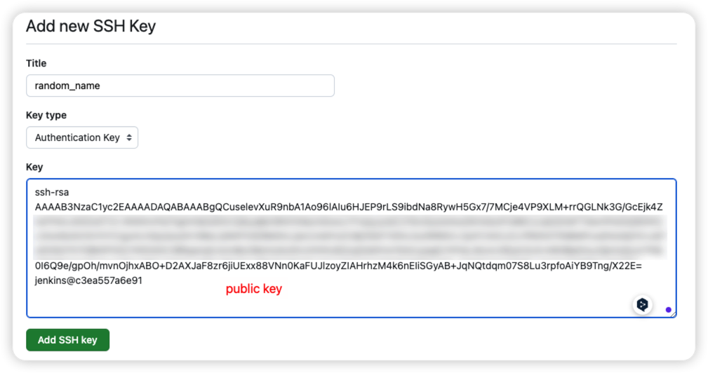
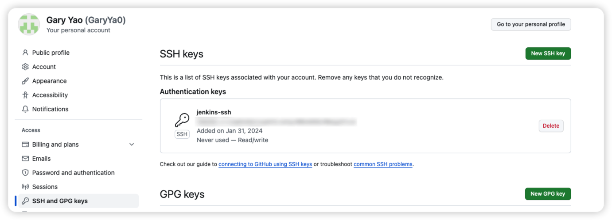
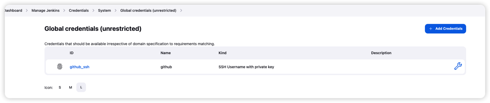
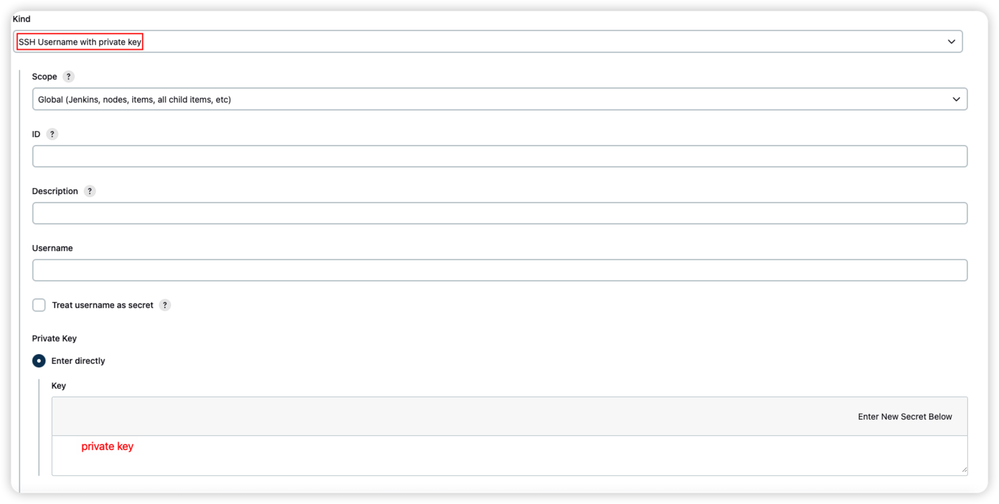
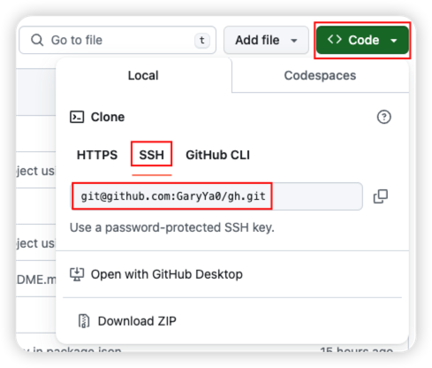
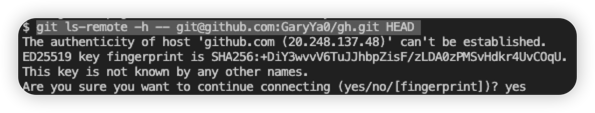
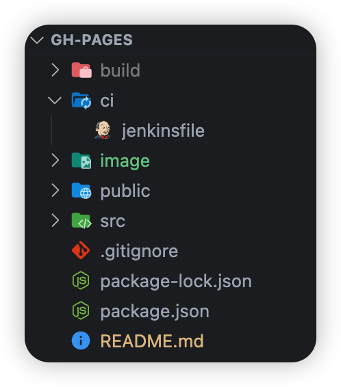
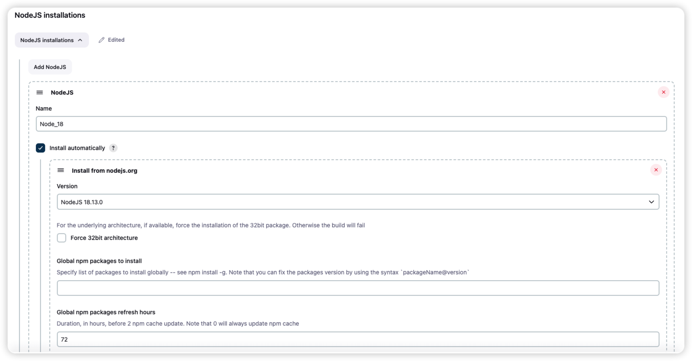
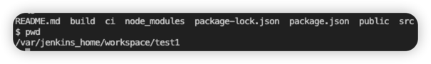

# Jenkins with gh-pages

## Github SSH Authentication

1. run `ssh-keygen` on Jenkins server CLI
2. `cat ~/.ssh/id_rsa.pub` to get public key
3. add public key to github repo settings
   **github profile → settings → SSH and GPG keys → New SSH key**

    

    
4. `cat ~/.ssh/id_rsa` to get private key
5. add private key to Jenkins server
   **Jenkins → Dashboard → Manage Jenkins → Credentials → System → Global credentials → Add Credentials**
   
   

## Jenkins Pipeline

1. Create a new Jenkins job
   **Jenkins → Dashboard → New Item → Pipeline**
2. Configure the pipeline
   - General
     - [X] GitHub project → Pipeline script from SCM**
       - Project url: `https://github.com/GaryYa0/gh.git/`
   - Build Triggers
     - [X] GitHub hook trigger for GITScm polling
   - Pipeline
     - Definition: `Pipeline script from SCM`
     - SCM: `Git`

       - Repositories
         - Repository URL: `git@github.com:GaryYa0/gh.git`

           > copy the ssh path from github repo
           >
         - Credentials: `github`

           > created credential in previous step
           >

           If `Failed to connect to repository : Command "git ls-remote -h https://git@github.com:GaryYa0/gh.git HEAD" returned status code 128: ` prompt, run `git ls-remote -h -- git@github.com:GaryYa0/gh.git HEAD` on Jenkins server CLI, and approve the fingerprint, `known_hosts` will be stored in `~/.ssh`
           
     - Branches to build

       - Branch Specifier: `*/main`
         > that's the branch of the source code, to specify the branch storing the deployment code, configure it in the `Jenkinsfile`
         >
   - Script Path: `ci/jenkinsfile`
     

## Jenkinsfile

```Groovy
pipeline {
  agent any
  tools {
    nodejs 'Node_18' // NodeJS installations needed, see note #1
  }
  stages {
    stage('Install dependencies') {
      steps {
        echo 'Installing dependencies...'
        sh 'npm install'
      }
    }
    stage('Deploy') {
      steps {
        echo 'Deploying...'
        // Add your deploy steps here
        sh 'npm run deploy'
      }
    }
  }
}
```

## Note

### 1. NodeJS installations

  **Jenkins → Dashboard → Manage Jenkins → Tools → NodeJS installations**
  

### 2. Clean node_modules

  project located at `~/workspace/{jenkins_job_name}`

  

  run `rm -rf node_modules` to clean the `node_modules` folder
